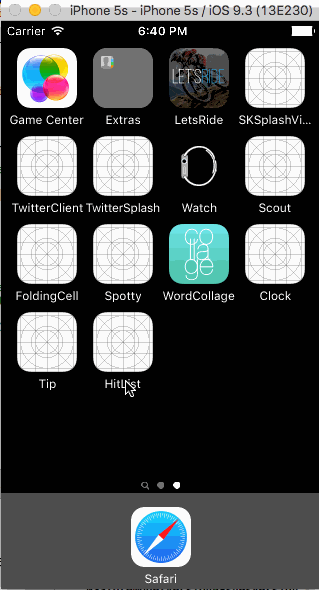

# Pre-work - *Tipsy*

**Tipsyp** is a tip calculator application for iOS.

Submitted by: **John Pham**

Time spent: **20** hours spent in total

## User Stories

The following **required** functionality is complete:

* [x] User can enter a bill amount, choose a tip percentage, and see the tip and total values.
* [x] Settings page to change the default tip percentage.

The following **optional** features are implemented:
* [x] UI animations
* [ ] Remembering the bill amount across app restarts (if <10mins)
* [x] Using locale-specific currency and currency thousands separators.
* [x] Making sure the keyboard is always visible and the bill amount is always the first responder. This way the user doesn't have to tap anywhere to use this app. Just launch the app and start typing.

The following **additional** features are implemented:

- [x] Scan receipt with BlinkOCR
- [ ] Save scan data use CoreData (Incompleted)

## Video Walkthrough

Here's a walkthrough of implemented user stories:

Demo video for ReceiptOCR: https://www.youtube.com/watch?v=canl7X8j7J0&feature=youtu.be

GIF created with [LiceCap](http://www.cockos.com/licecap/).
## Build App Instruction
- Download MicroBlink Archive from this link: https://drive.google.com/file/d/0B_rXIv9tsF-8cDdTSUMtbHdBUUE/view?usp=sharing and unzip to source code folder
- [Generate](https://microblink.com/login?url=/customer/generatedemolicence) a **free demo license key** to start using the SDK in app (registration required) - 1 license key work with 1 app indentifier only
- OCR work only on real-device with camera support
## Notes

BlinkOCR is hard for implement without document

## License

    Copyright [2016] [John Pham]

    Licensed under the Apache License, Version 2.0 (the "License");
    you may not use this file except in compliance with the License.
    You may obtain a copy of the License at

        http://www.apache.org/licenses/LICENSE-2.0

    Unless required by applicable law or agreed to in writing, software
    distributed under the License is distributed on an "AS IS" BASIS,
    WITHOUT WARRANTIES OR CONDITIONS OF ANY KIND, either express or implied.
    See the License for the specific language governing permissions and
    limitations under the License.

==

Git LFS
-------

To clone and use this repository, you'll need Git Large File Storage (LFS).

Our [Developer Guide](http://developer.lsst.io/en/latest/tools/git_lfs.html)
explains how to set up Git LFS for LSST development.
